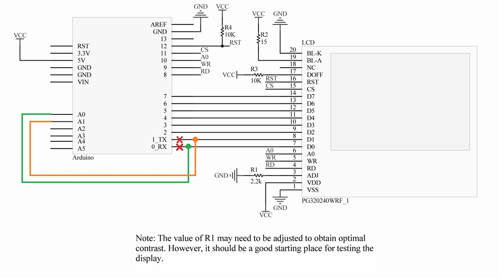

# Arduino LCD library for the Crystalfontz CFAG320240CX display [Updated 2018]

## S1D13700 Library Documentation
* http://www.cafelogic.com/download/s1d13700_arduino_documentation/

## How To Use
* Example -> Arduino sketch when default pins changed to custom
* S1D13700 -> Arduino library -> file belongs to "Documents\Arduino\libraries"

## Schematic after default pin changed to custom:
